# OpiCards

OpiCards consiste en un sitio web donde distintos usuarios pueden públicar, leer y comentar reseñas. Para esto, los usuarios deben crear una cuenta en el sitio, la cual le será útil para comentar reseñas bajo su propio nickname, crear, modificar y eliminar sus propias reseñas, puntuar otras reseñas, entre otras funcionalidades.\
\
El sitio cuenta con una página de inicio de sesión, una página de registro de nuevos usuarios, una página de inicio con las últimas 5 reseñas publicadas de otros usuarios, y una página donde el usuario puede ver su perfil con sus propias reseñas. Además cuenta con formularios para las distintas funcionalidades, como formulario de inicio de sesión, formulario de registro de usuario, formulario de creación de reseña y formulario de comentarios.\
\
Para registrarse, el usuario debe ingresar su nombre, apellido, país, fecha de nacimiento, un username único, su e-mail de registro y una contraseña que luego debe repetir por seguridad. Una vez registrado, será redireccionado a la página de inicio de sesión, donde puede iniciar sesíon con su username y contraseña. Con esto el usuario ya puede crear reseñas, ver otras reseñas y hacer comentarios. Al ver reseñas, el usuario puede filtrar por nombre de usuario y/o categoría de la reseña. Para crear una nueva reseña debe ingresar el nombre del producto, el contenido de su reseña, la categoría a la que pertenece el producto y una puntuación en estrellas de 1 a 5. Una vez publicada, el autor de esta reseña puede modificarla o eliminarla cuando desee. Para crear un comentario, el usuario debe ingresar el comentario y publicarlo, el cual aparecerá junto a su username. También puede puntuar las reseñas de otros usuarios según si le gustan o no.

## Requerimientos
* Tener instalado Git
* Tener instalado Python 3.10.3

## Instalación
Pasos a seguir:
1. Clonar el repositorio en el directorio deseado
2. Crear ambiente virtual con el siguiente comando:
```
$ python -m venv env
```
3. Activar el ambiente virtual:
* Windows:
```
> env\Scripts\activate
```
* Linux:
```
$ source env\Scripts\activate
```
4. Instalar las siguientes librerías:
* asgiref 3.6.0
* Django 4.2
* pytz 2020.1
* sqlparse 0.4.3
* tzdata 2023.3
* Pillow 9.5.0\
Pueden instalarse todas con el siguiente comando:
```
$ pip install -r requirements.txt
```
5. Crear directorio migrations y base de datos dentro del directorio del pryecto:
```
$ cd group_6_project
$ python manage.py makemigrations reviews
$ python manage.py migrate
```
6. Ejecutar el servidor:
```
$ python manage.py runserver
```

## Uso
Para poder utilizar la aplicación debe haber realizado los pasos de instalación y tener el ambiente virtual activado.\
\
Debe entrar a entrar a http://127.0.0.1:8000/register donde podrá ver el formulario de registro de usuario, donde deberá crear una cuenta
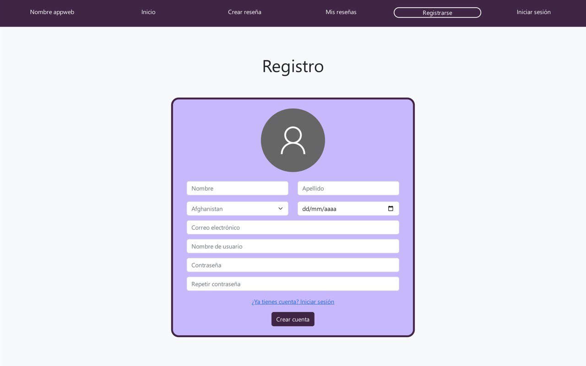
\
Una vez creada la cuenta se rediccionará a la página de inicio de sesión http://127.0.0.1:8000/login/ de manera automática, donde deberá iniciar sesión con el username y contraseña que indicó en el formulario de registro
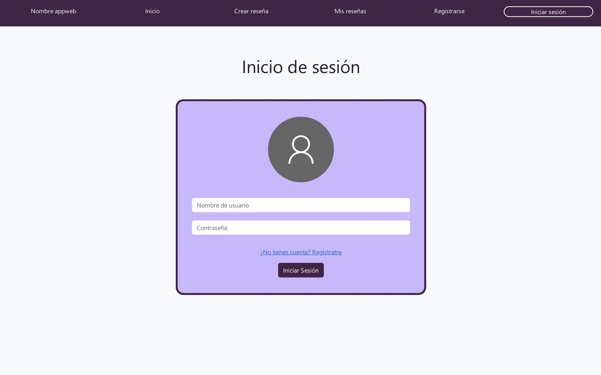
\
Ahora que la sesión fue iniciada se rediccionará a la página http://127.0.0.1:8000/ShowReviews/ donde podrá ver las reseñas de otros usuarios
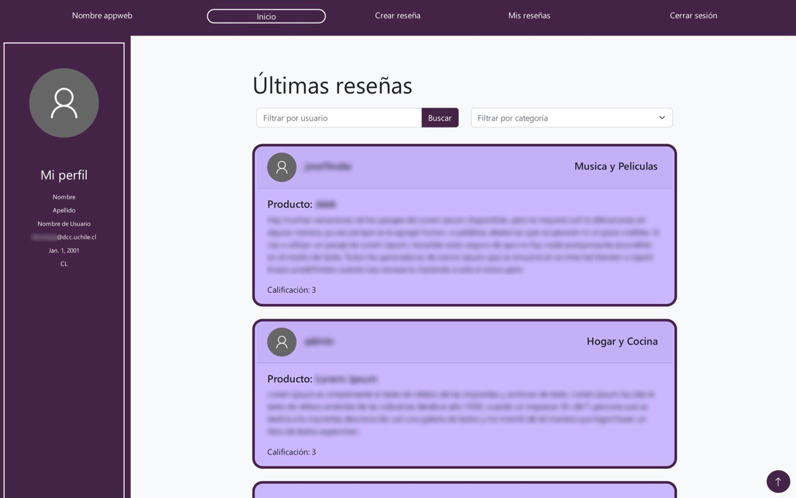
\
Al hacer click en el botón Crear reseña se rediccionará a la página http://127.0.0.1:8000/ShowReviews/ donde verá el formulario de creación de reseña, y la podrá subir con el botón Crear
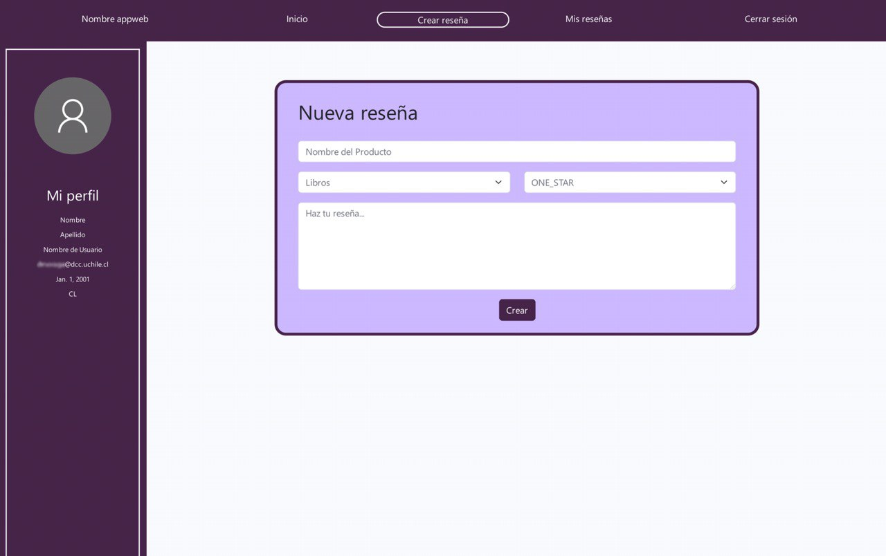
\
Una vez subida, se le redireccionará nuevamente a la página de inicio donde aparecerá su reseña como la última que fue subida, esta tendrá un botón de Eliminar con el que puede eliminar la reseña recien creada si lo desea
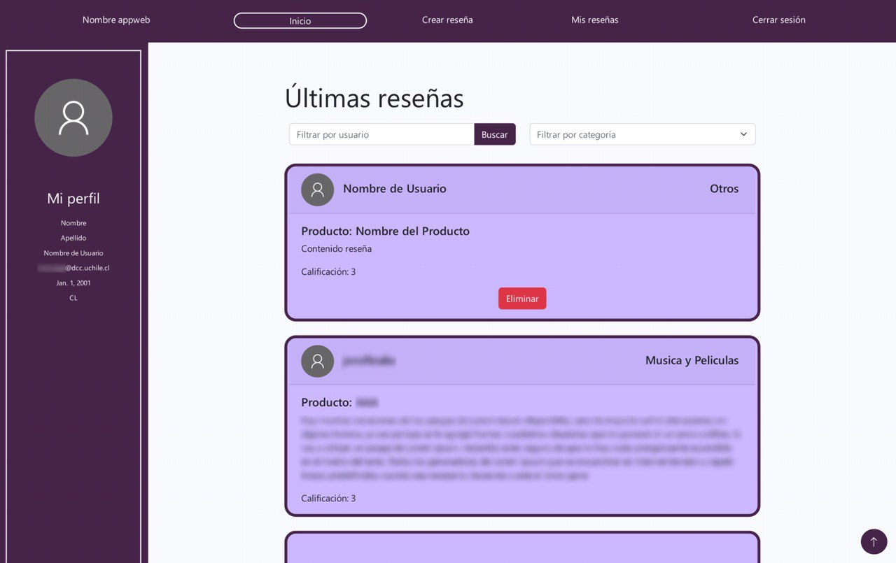
\
Haciendo click en mis reseñas se redirecciona a la página http://127.0.0.1:8000/myReviews/ donde aparecen sus reseñas creadas y puede modificarlas y eliminarlas
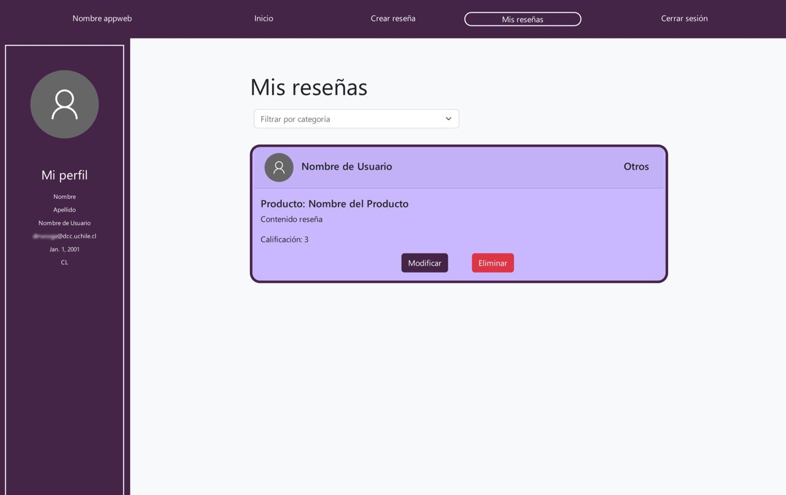
\
Si hace click en el botón Modificar se redireccionará a http://127.0.0.1:8000/modify/56 donde podrá modificarla y volver a guardarla con el botón Guardar
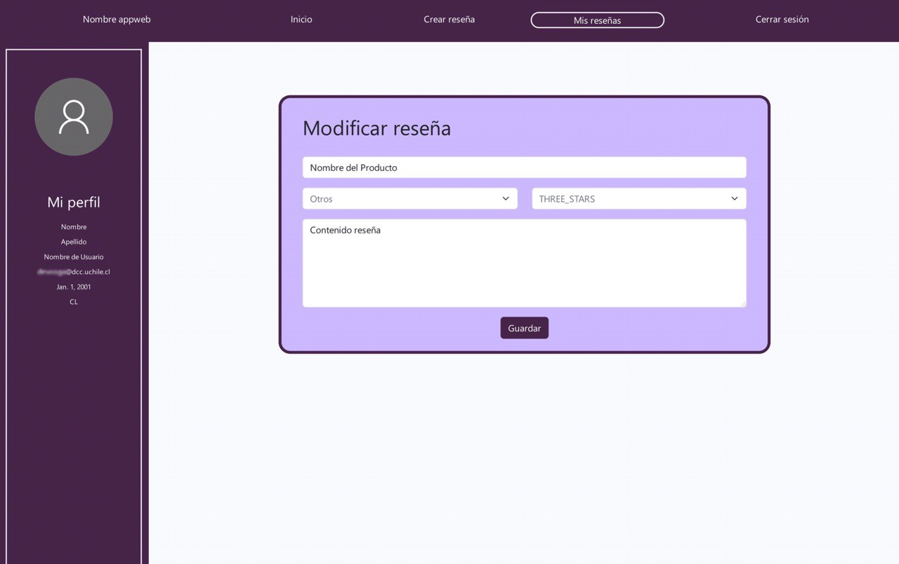
\
Si hace click en eliminar la reseña será eliminada y desaparecerá de la página de inicio
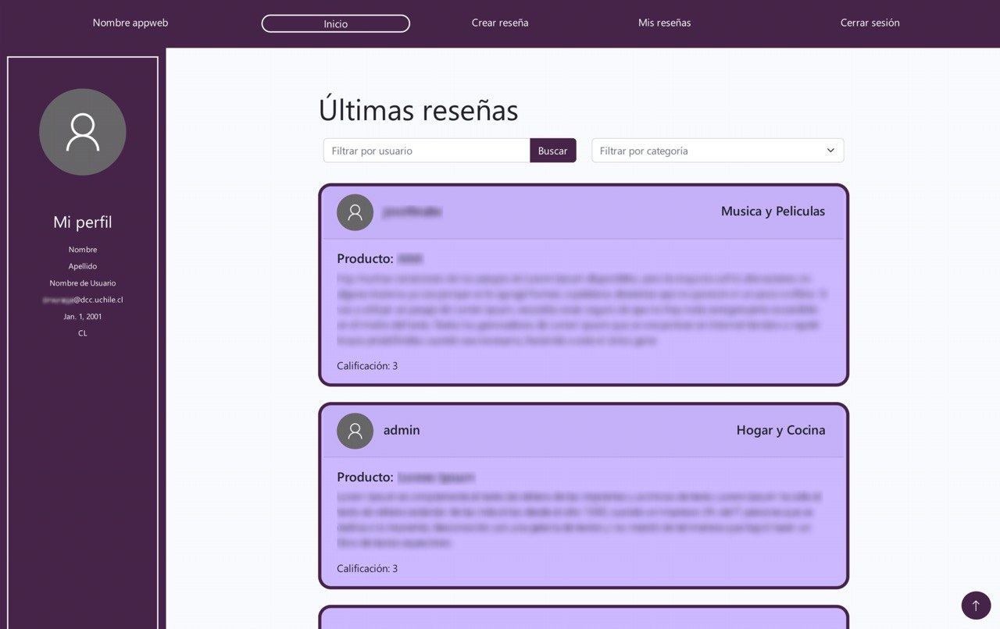
\
Si hace click en Like en la reseña, aumentará su contador de "me gusta". Si vuelve a hacer click en ese botón, decrecerá el contador. Usted no puede aumentar el contador de "me gusta" y el de "no me gusta" al mismo tiempo, prevalece la función del último botón presionado.
Si hace click en Dislike en la reseña, aumentará su contador de "no me gusta". Si vuelve a hacer click en ese botón, decrecerá el contador. Usted no puede aumentar el contador de "me gusta" y el de "no me gusta" al mismo tiempo, prevalece la función del último botón presionado.
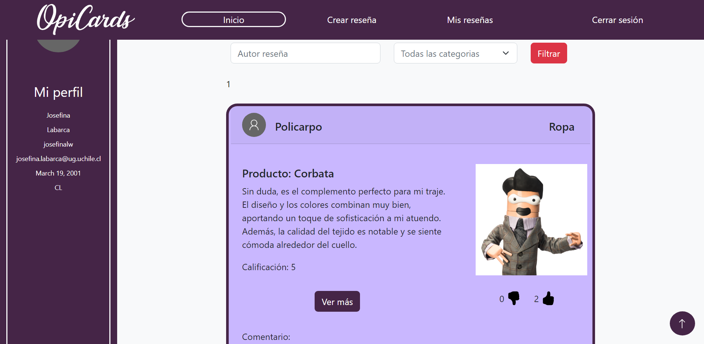
\
Si hace click en Filtrar en la página de inicio, sólo se mostrarán las reseñas que coincidan con los criterios (username y categoría) especificados en los campos junto al botón. 
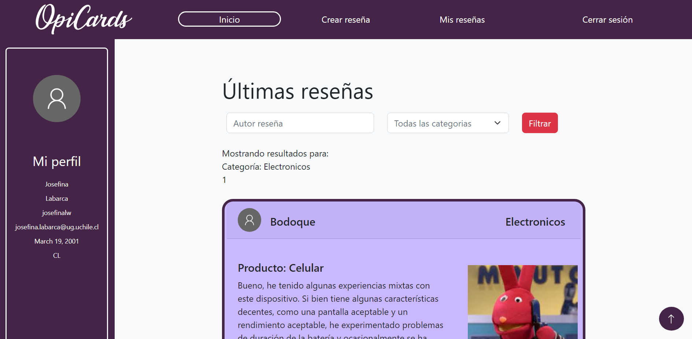
\
Si hace click en Comentar en la reseña, se creará un objeto comentario (con el texto ingresado en el campo anterior) que aparecerá en la parte inferior de la reseña al recargar la página. 
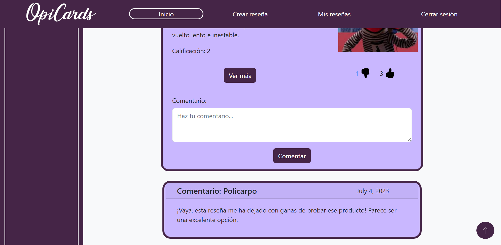
\
Al hacer click en Cerrar sesión desaparecerá la barra izquierda con los datos de su perfil y en lugar de Cerrar sesión aparecerá la opción Iniciar sesión
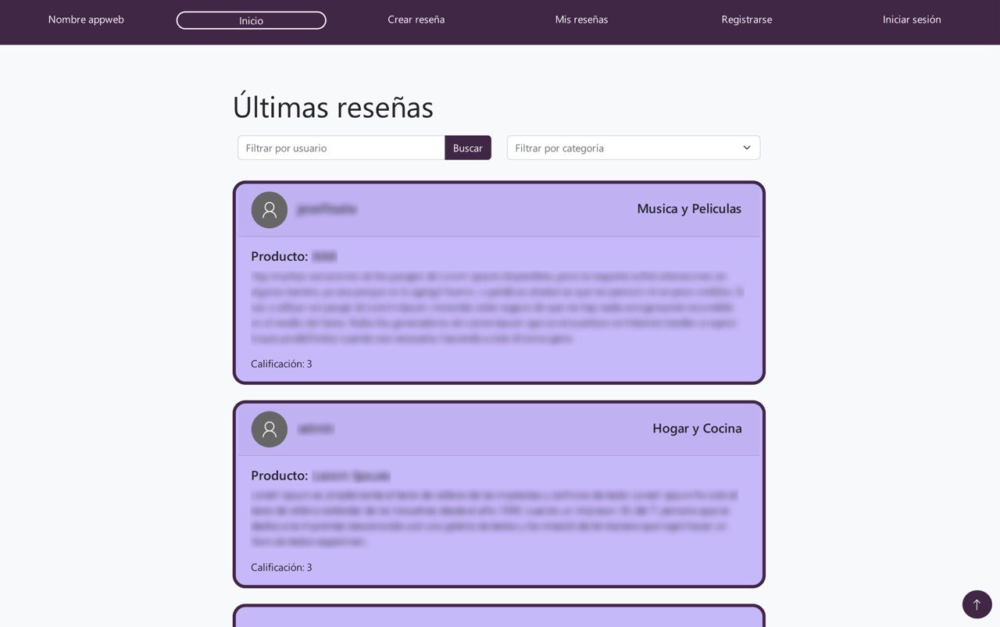


<!-- Imagen de uso de los filtros -->

## Autores
* Josefina Labarca
* Gustavo Medel
* Sebastián Mira
* Daniela Moraga
* Sergio Rojas

## Recursos adicionales
* [Tutoriales proporcionados por el curso](https://github.com/Aux-Ing-1)

